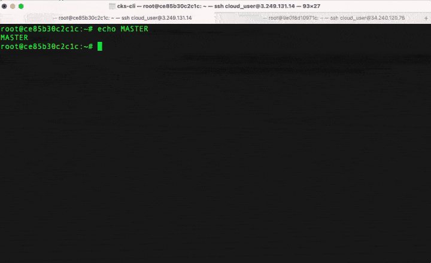

---
hide:
- navigation
- toc
---
{ align=left }

`CKS CLI` is command line interface, designed to help for preparing for CKS (Certified Kubernetes Security Sepciality) exams.

`CKS CLI` is easy to use. Just install the binary and you're ready to proceed for CKS exam preparation.

    <h1 id="demo">Demo</h1>

<figure style="text-aligh: center">
  
  <figcaption>Demo: Cluster Setup for CKS prepa</figcaption>
</figure>